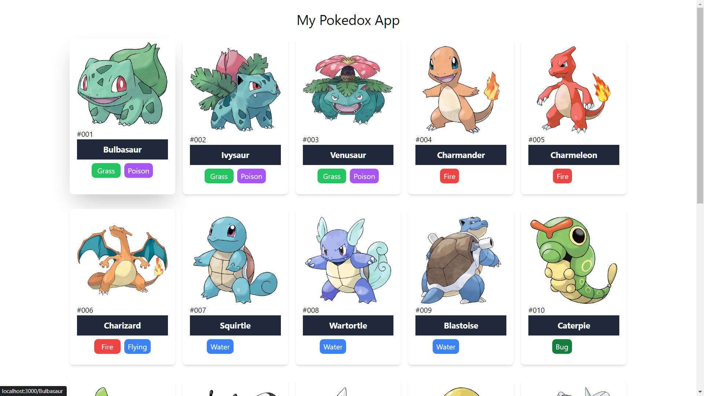
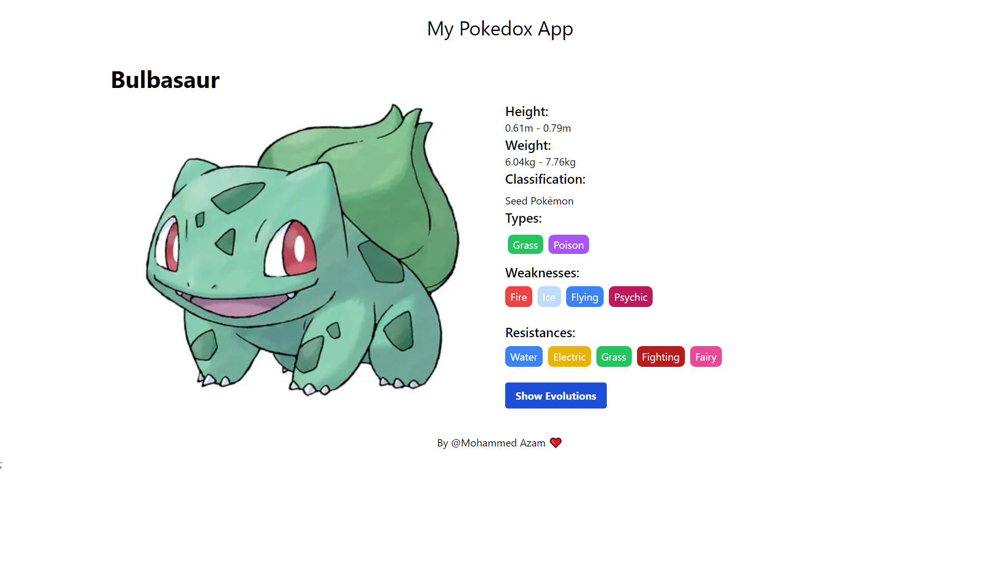

# Getting Started with Pokemons App

## To Run this Project in your System (Windows)

### 1. Install [Node.js](https://nodejs.org/en/download)

### 2. Use [VSCode](https://code.visualstudio.com/download) for Better Experience

### 3. Run `npm install` to install dependencies

### 4. Run `npm run dev`

## Screenshots

### Homepage

### Details Page

Views Count: 

Pulls Count: 
